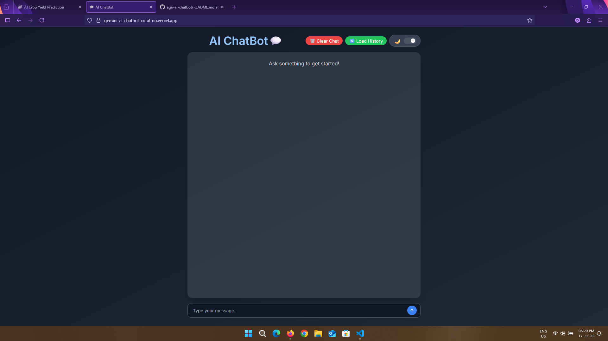

# Gemini AI Chatbot 💬

Created By Drumil Patel🔥

A modern, aesthetic chatbot built with React, Tailwind CSS, and Google's Gemini API.

## 🔥 Features

- ✨ Gemini 2.0 Flash API integration
- 🌙 Toggle between light and dark mode
- 🧠 Smart markdown-rendered AI replies
- 🎨 Animated chat bubbles using Framer Motion
- ⚡ Responsive, mobile-friendly layout
- 🧵 Modern UI with Inter font & TailwindCSS v4
- 📦 Clean component structure for easy expansion

## 🚀 Tech Stack

- React.js
- Tailwind CSS v4
- Vite
- Framer Motion
- React Markdown
- Gemini API (Google AI)

## 🌐 Live Demo

> 🟢 Deployed on Vercel  
> 👉 [Click here to try the chatbot](https://gemini-ai-chatbot-coral-nu.vercel.app/)


## 📷 Preview



## 📁 Environment Variables

Create a `.env` file in the root directory with the following:

```env
VITE_API_GENERATIVE_LANGUAGE_CLIENT=your_openai_or_gemini_api_key
Replace your_openai_or_gemini_api_key with your actual API key from Google AI Studio.

## 🛠️ Setup Instructions

```bash
git clone https://github.com/yourusername/gemini-ai-chatbot.git
cd gemini-ai-chatbot
npm install
npm run dev
